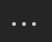

# Soccer is the best

## Usage
### In der Schule
1. In der schule geh zu deinem HTML Projekt
2. Log in auf github.com
3. Geh zu deinem repository `html-prac`
4. Lade die neuesten files runter
5. Arbeite daran 
6. Wenn du fertig bist, geh zu https://github.com/KruegerAl/html_prac/upload/master 
7. Lade deine neuen files hoch. `Drag and Drop` oder `Select File`
8. Gib eine commit message ein
9. Click auf `Commit Changes`

### Zuhause
1. Öffne `Visual studio code`
2. Auf der linken seite, click auf dieses icon 
3. Oben auf der linken bildhälfte, click auf die drei punkte 
4. Select `Pull`
5. Geh zu 
6. Arbeite an deinen files
7. Geh wieder zu  und click auf den checkmark 
8. Gib eine message ein und `Enter`
Geh wieder zu 
9. Select `Push`

### Enjoy

© 2020 Andreas Krüger
MIT License 
